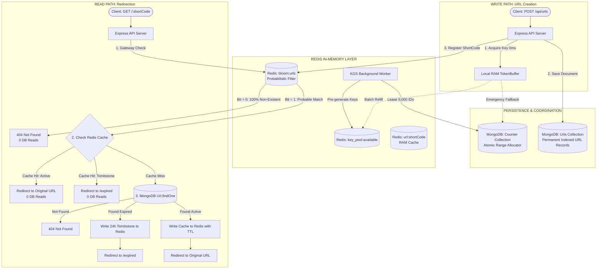

# Distributed URL Shortener

A high-performance, distributed URL shortening service built with modern cloud architecture. It combines layered in-memory token buffering, atomic range block leasing, probabilistic Bloom filtering, and Redis caching to deliver sub-millisecond redirection latency, high write throughput, and zero key collisions.

---

## Features

- **Distributed Key Generation Service (KGS)**: Dedicated background daemon worker that monitors the centralized Redis key pool (`key_pool:available`) and pre-generates unique Base-62 short codes ahead of time without blocking client traffic.
- **In-Memory Token Buffering**: Express API instances maintain a local RAM buffer of short codes (`TokenBuffer`), delivering **$\sim 0\text{ ms}$ key acquisition latency** on URL creation with zero network roundtrips.
- **Centralized Range Block Allocator**: Uses an atomic persistent `Counter` in MongoDB to lease numeric ranges ($5,000$ IDs per batch). This eliminates lock contention on individual writes and guarantees monotonic, collision-free short codes across restarts and outages.
- **Redis Bloom Filter (Cache Penetration & DDoS Defense)**: Gateway probabilistic filter utilizing Kirsch-Mitzenmacher multi-hashing ($k=5$) to detect non-existent or malicious short codes in sub-millisecond time with **0 database reads**.
- **High-Performance Caching & Fast Redirections**:
  - **Active URLs**: Served from Redis RAM cache in $\sim 0.5\text{ ms}$.
  - **Cold Misses**: Retrieved directly from the indexed MongoDB `urls` collection and cached for subsequent requests.
  - **Negative Tombstones**: Expired URLs store a 24-hour tombstone in Redis (`{"isExpired": true}`), redirecting to `/expired` with 0 database queries.
- **Multi-Tier Fault Tolerance**:
  - Resilient 3-tier key acquisition: Local RAM Buffer $\to$ Centralized Redis Pool $\to$ Emergency Direct Range Allocator.
  - If Redis is offline, API servers automatically lease discrete blocks directly from MongoDB and buffer them in RAM, maintaining continuous service.
- **API Rate Limiting**: Built-in sliding-window rate limiters protecting authentication and URL creation endpoints against abuse.
- **Analytics & Click Tracking**: Asynchronously tracks user visits, device categories (mobile, tablet, desktop via `ua-parser-js`), referrers, and daily click distributions.
- **Modern User Interface**: Responsive dashboard built with React 19, TypeScript, and Tailwind CSS, featuring Recharts visual analytics and QR code generation.

---

## Tech Stack

### Frontend
- React 19 (TypeScript)
- Vite
- Tailwind CSS
- React Router DOM
- Recharts
- React Query

### Backend
- Node.js (ES6 Modules)
- Express 5
- MongoDB / Mongoose (Primary Data Store & Range Counter)
- Redis (Key Pool, Bloom Filter, RAM Cache)
- Sqids (Base-62 Bijective Encoding)
- TokenBuffer (In-Memory Ring Buffer)

---

## System Architecture



---

## Getting Started

### Prerequisites
- [Docker Desktop](https://www.docker.com/products/docker-desktop/)
- [Node.js](https://nodejs.org/) (v22+ recommended for running outside containers)

---

### Running via Docker Compose

Docker starts the React Frontend, Node.js Backend API, KGS Background Worker, MongoDB, and Redis in isolated containers:

1. **Clone the repository**
   ```bash
   git clone https://github.com/saumyaketu/distributed-url-shortener.git
   cd Distributed-URL-Shortener
   ```
2. **Configure Environment Variables**
   ```bash
   cp frontend/.env.sample frontend/.env
   cp backend/.env.sample backend/.env
   ```
3. **Build and Run the Containers**
   ```bash
   docker-compose up --build
   ```

#### Access the Apps
* **Frontend:** `http://localhost:5173`
* **Backend API Server:** `http://localhost:5000`

To stop containers:
```bash
docker-compose down
```

---

### Running Manually for Development

1. **Start Backend API Server**
   ```bash
   cd backend
   npm install
   npm run dev
   ```
   *Runs server at `http://localhost:5000`*

2. **Start KGS Worker Daemon (Optional / Standalone)**
   ```bash
   cd backend
   npm run worker:kgs:dev
   ```
   *Continuously monitors and refills the Redis key pool in the background.*

3. **Start Frontend**
   ```bash
   cd ../frontend
   npm install
   npm run dev
   ```
   *Runs Vite hot-reloading server at `http://localhost:5173`*

---

## Testing Suite

The project includes an automated test suite verifying Key Generation, TokenBuffer concurrency, Redis pool replenishment, Bloom Filter DDoS defense, and failover resilience.

Run all tests:
```bash
cd backend
npm test
```

### Verified Test Cases:

#### 1. Key Generation Service (KGS) & TokenBuffer Tests (`npm run test:kgs`)
* **Test 1: Base-62 Range Generation & Uniqueness** (Generates 2,000+ keys with 0 collisions).
* **Test 2: Atomic Range Block Allocation** (Ensures discrete, non-overlapping numeric ranges leased from MongoDB).
* **Test 3: Redis Key Pool Replenishment** (Verifies centralized Redis list management).
* **Test 4: In-Memory Token Buffer & 0ms Fast Path** (Verifies sub-millisecond RAM retrieval).
* **Test 5: High-Concurrency Burst** (Simulates 300+ parallel requests with 100% uniqueness).

#### 2. Redis Bloom Filter Tests (`npm run test:bloom`)
* **Test 1: Hash Function Offsets** (Verifies uniform Kirsch-Mitzenmacher 32-bit hash distribution).
* **Test 2: Positive Lookup Guarantee** (100% detection on known short codes with 0 false negatives).
* **Test 3: Cache Penetration Rejection** (Rejects >99.9% of random bogus/malicious short codes).
* **Test 4: Sub-Millisecond Speed Benchmark** (Pipelined `client.multi()` execution).
* **Test 5: Streaming Cursor MongoDB Hydration** (Streams records in chunks via cursor, preventing Node.js Heap OOM).
* **Test 6: Distributed Fail-Open Resilience** (Guarantees zero split-brain false 404s and zero in-memory RAM leaks).

#### 3. Negative Tombstone Caching Tests (`npm run test:tombstone`)
* Verifies that expired URLs write a 24-hour negative tombstone into Redis, ensuring all subsequent requests serve `/expired` with 0 database reads.
