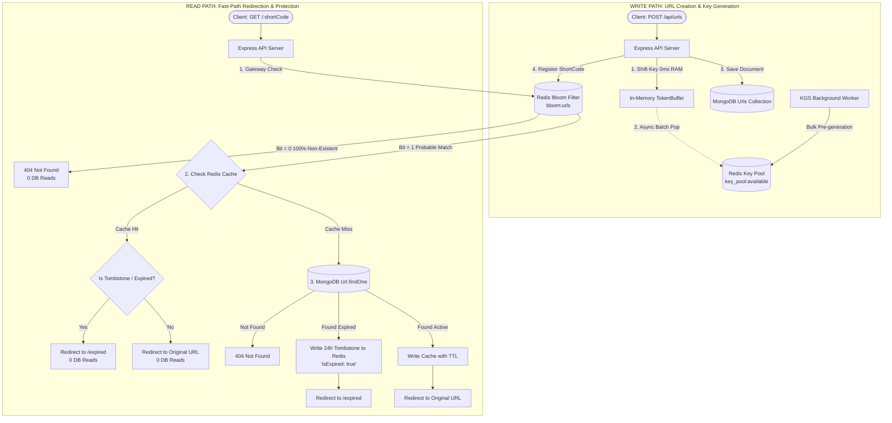

# Distributed URL Shortener

A high-performance, full-stack, distributed URL shortening service built with modern architecture. It leverages layered design patterns, in-memory caching for minimal latency, and robust request handling.

---

## Features

- **Distributed Key Generation Service (KGS)**: Dedicated background daemon worker pre-allocating range blocks and generating thousands of unique Base-62 short codes offline into a centralized Redis key pool (`key_pool:available`).
- **In-Memory Token Buffering**: Web instances pull and buffer short codes directly in local RAM (`TokenBuffer`), delivering **$\sim 0\text{ ms}$ key acquisition latency** with zero runtime database reads and automatic non-blocking background refills.
- **Redis Bloom Filter (Cache Penetration & DDoS Defense)**: Gateway probabilistic filter utilizing Kirsch-Mitzenmacher multi-hashing ($k=5$) and pipelined Redis operations (`client.multi()`) to reject non-existent or malicious short codes in sub-millisecond time with **0 database reads**.
- **Multi-Tier Fault Tolerance**: Resilient fallback hierarchy (RAM Buffer $\to$ Centralized Redis Pool $\to$ Emergency MongoDB Range Counter Allocator) ensuring 100% uptime and zero duplicate collisions even during Redis restarts or network partitions.
- **User Authentication**: Secure user registration and login utilizing `bcryptjs` password hashing and HttpOnly JWT cookies.
- **Performance Caching**: Layered architecture utilizing Redis to cache active short codes and redirect routes, minimizing MongoDB workloads.
- **Analytics & Tracking**: Records metrics including device breakdowns (via `ua-parser-js`), referrers, and daily click distributions.
- **Rate Limiting**: Built-in protection algorithms leveraging Redis to prevent DDoS and API abuse.
- **Interactive UX**: Built with React & TypeScript, rendering Recharts visualizations, interactive QR code creators, and responsive notifications (`react-hot-toast`).
- **Link Expiration with Negative Tombstone Caching**: Custom time-to-live (TTL) settings. When a link expires, an Expired Tombstone (`{"isExpired": true}`) is preserved in Redis with a 24-hour TTL, preventing cache stampedes and serving the `/expired` page with **0 MongoDB reads**.
- **Containerized Microservice Ecosystem**: Multi-container architecture orchestrating the Frontend, Backend API, KGS Background Worker, MongoDB, and Redis.

---

## Tech Stack

### Frontend
- React 19 (TypeScript)
- Vite
- Tailwind CSS
- React Router DOM
- Recharts
- React Query

### Backend
- Node.js (ES6 Modules)
- Express 5
- MongoDB / Mongoose
- Redis Cloud / Local
- Sqids (Base-62 Encoding)
- Redis Bloom Filter (BitMap + client.multi Pipeline)
- TokenBuffer (In-Memory Ring Buffer)

---

## Unified Distributed Architecture




---

## Getting Started

### Prerequisites
Make sure you have the following installed on your local environment:
- [Docker Desktop](https://www.docker.com/products/docker-desktop/)
- [Node.js](https://nodejs.org/) (v22+ recommended for running outside containers)

---

### Running the Whole Ecosystem via Docker

Running the application with Docker automatically sets up the React Frontend, Node.js Backend API, KGS Background Worker, MongoDB database, and Redis cache inside isolated micro-containers.

1. **Clone the repository**
   ```bash
   git clone https://github.com/saumyaketu/distributed-url-shortener.git
   cd Distributed-URL-Shortener
   ```
2. **Configure Environment Variables**
   Ensure your environment variables are configured:
   ```bash
   cp frontend/.env.sample frontend/.env
   cp backend/.env.sample backend/.env
   ```
3. **Build and Run the Containers**
   Execute this command from the root directory:
   ```bash
   docker-compose up --build
   ```

#### Access the Apps
* **Frontend:** http://localhost:5173
* **Backend API Server:** http://localhost:5000

To stop the containers, run:
```bash
docker-compose down
```

---

### Running Manually for Development

If you prefer running services directly in development mode:

1. **Start Backend API Server**
   ```bash
   cd backend
   npm install
   npm run dev
   ```
   *Runs server at http://localhost:5000*

2. **Start KGS Worker Daemon (Optional / Standalone)**
   ```bash
   cd backend
   npm run worker:kgs:dev
   ```
   *Proactively manages and refills the Redis key pool in the background.*

3. **Start Frontend**
   ```bash
   cd ../frontend
   npm install
   npm run dev
   ```
   *Runs Vite Hot-Reloading server at http://localhost:5173*

---

## Testing Suite

The project includes an automated test suite verifying Key Generation, TokenBuffer concurrency, Redis pool replenishment, Bloom Filter DDoS defense, and failover resilience.

Run all tests:
```bash
cd backend
npm test
```

### Verified Test Cases:

#### 1. Key Generation Service (KGS) & TokenBuffer Tests (`npm run test:kgs`)
* **Test 1: Base-62 Range Generation & Uniqueness** (Generates 2,000+ keys with 0 collisions).
* **Test 2: Atomic Range Block Allocation** (Ensures discrete, non-overlapping numeric ranges).
* **Test 3: Redis Key Pool Replenishment** (Verifies centralized Redis list management).
* **Test 4: In-Memory Token Buffer & 0ms Fast Path** (Verifies sub-millisecond RAM retrieval).
* **Test 5: High-Concurrency Burst** (Simulates 300+ parallel requests with 100% uniqueness).

#### 2. Redis Bloom Filter Tests (`npm run test:bloom`)
* **Test 1: Hash Function Offsets** (Verifies uniform Kirsch-Mitzenmacher 32-bit hash distribution).
* **Test 2: Positive Lookup Guarantee** (100% detection on known short codes with 0 false negatives).
* **Test 3: Cache Penetration Rejection** (Rejects >99.9% of random bogus/malicious short codes).
* **Test 4: Sub-Millisecond Speed Benchmark** (Pipelined client.multi() execution).
* **Test 5: Streaming Cursor MongoDB Hydration** (Streams records in chunks via cursor, preventing Node.js Heap OOM).
* **Test 6: Distributed Fail-Open Resilience** (Guarantees zero split-brain false 404s and zero in-memory RAM leaks).

#### 3. Negative Tombstone Caching Tests (`npm run test:tombstone`)
* Verifies that expired URLs write a 24-hour negative tombstone into Redis, ensuring all subsequent requests serve `/expired` with 0 database reads.
